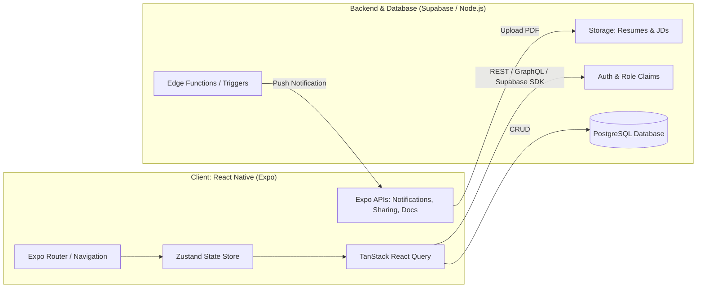
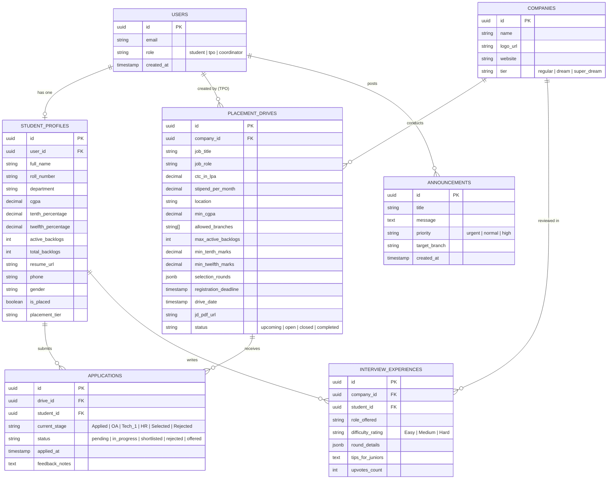

# 🎓 CampusHire — University Placement Cell Mobile Application
> **Comprehensive Architecture, Feature Specification & Development Roadmap**  
> **Platform:** React Native (Expo Managed Workflow)  
> **Target OS:** Android & iOS (Cross-Platform)

---

## 1. Executive Summary & Problem Statement

### The Problem
University placement drives are traditionally disorganized:
- Training & Placement Offices (TPOs) communicate via chaotic WhatsApp groups, scattered emails, and Google Sheets.
- Students miss registration deadlines or struggle to know whether they meet complex criteria (CGPA cutoff, backlog limits, branch constraints).
- Tracking interview stages (Online Assessment $\rightarrow$ Technical Round $\rightarrow$ HR $\rightarrow$ Offer) causes stress and lack of transparency.
- Manual eligibility verification takes hundreds of hours of staff time.

### The Solution: CampusHire
A unified, mobile-first Placement Management Ecosystem built with **React Native (Expo)** featuring:
1. **Automated Eligibility Engine**: Instant calculation showing whether a student qualifies to apply based on their live academic record.
2. **Interactive ATS (Application Tracking System)**: Visual step-by-step progress tracking for every applied drive.
3. **Multi-Role Portal**: Dedicated student views and TPO/Coordinator administrative dashboards.
4. **Senior Interview Experiences & Archives**: Peer-to-peer placement preparation hub.
5. **Real-time Notifications & Announcements**: Instant broadcast alerts for drive schedules, venue changes, and shortlists.

---

## 2. User Personas & Role-Based Access Control (RBAC)


---

## 3. Comprehensive Feature Matrix

### 3.1. Student Modules

| Feature | Description | Implementation Details |
| :--- | :--- | :--- |
| **Academic Profile Onboarding** | Captures 10th %, 12th/Diploma %, Current CGPA, Branch, Active & Historical Backlogs, Skills, and Resume PDF. | Multi-step form with validation (`react-hook-form` + `zod`). |
| **Smart Eligibility Engine** | Compares student credentials against drive rules in real-time. Displays a badge (**Eligible** ✅ / **Ineligible** ❌) with explicit criteria reasons. | Dynamic evaluation function: evaluates CGPA, Branch, Backlogs, and Gender diversity criteria. |
| **Drive Explorer & Categorization** | Filter drives by Category (**Super Dream** $\ge 12$ LPA, **Dream** 6–12 LPA, **Regular** $< 6$ LPA), Job Type (Internship / Full-time), or Status (Open / Upcoming / Closed). | FlatList with optimized rendering, search bar, chips filter. |
| **Job Detail Sheet & JD Viewer** | Complete job profile: CTC breakdown, roles, stipend, selection stages timeline, registration deadline countdown timer, and embedded JD PDF view. | `expo-document-picker`, `react-native-pdf` or system webview. |
| **Application Pipeline Tracker (ATS)** | Visual vertical/horizontal stepper displaying current status: `Applied` $\rightarrow$ `OA Shortlist` $\rightarrow$ `Tech Round 1` $\rightarrow$ `HR Round` $\rightarrow$ `Offered` / `Rejected`. | Custom stepper component with color-coded status badges and interview slot details. |
| **Peer Interview Experience Hub** | Read reviews and questions from seniors who cracked companies (difficulty ratings, rounds, key DSA/tech topics). | Searchable community feed with upvoting and company tags. |
| **Placement Policy & Offer Rules** | Displays college guidelines (e.g., "1 Core + 1 Dream Offer" rule, penalty/blacklisting rules for no-shows). | Markdown viewer screen with easy reference search. |
| **Push Notifications** | Instant alerts for shortlisted students, OA test links, upcoming interview reminders, and deadline warnings. | `expo-notifications` linked with backend triggers. |

---

### 3.2. TPO & Placement Coordinator (Admin) Modules

| Feature | Description | Implementation Details |
| :--- | :--- | :--- |
| **Drive Creation Wizard** | Publish a job drive with company details, CTC package, registration deadline, eligibility constraints, and round definitions. | Multi-step form with date-time picker (`@react-native-community/datetimepicker`). |
| **Applicant Management & Filtering** | View all registered students per drive. Instant filtering by CGPA range, department, gender, and backlog count. | Virtualized data table with filter chips and search. |
| **1-Click CSV/Excel Export** | Generate official applicant lists formatted for company HRs (Roll No, Name, Email, CGPA, Resume link). | `xlsx` / `json-to-csv` export integrated with `expo-sharing`. |
| **Round Advancement / Bulk Status Update** | Move selected candidates from Round 1 to Round 2 with one tap or by uploading a shortlist file. | Batch status mutation with optimistic UI update. |
| **Campus Broadcast / Notice Board** | Send priority announcements (e.g., "Google OA delayed by 30 mins to Lab 3"). | Push notification broadcast with alert priority tagging (`Urgent`, `Info`, `Results`). |
| **Placement Analytics Dashboard** | Real-time graphs: Total Placed vs Unplaced %, Branch-wise placement rate, Average & Highest CTC package. | `react-native-chart-kit` or `victory-native`. |

---

## 4. The "Killer Feature": Automated Eligibility Calculation Engine

One of the main reasons college projects receive top marks is demonstrable business logic. Here is the formal specification of the Eligibility Engine:

```typescript
export interface EligibilityCriteria {
  minCgpa: number;
  allowedBranches: string[];
  maxActiveBacklogs: number;
  maxBacklogHistory: number;
  minTenthMarks: number;
  minTwelfthMarks: number;
  allowedGenders?: ('all' | 'male' | 'female');
}

export interface StudentProfile {
  cgpa: number;
  branch: string;
  activeBacklogs: number;
  totalBacklogHistory: number;
  tenthPercentage: number;
  twelfthPercentage: number;
  gender: 'male' | 'female' | 'other';
  hasAcceptedOffer: boolean;
  acceptedOfferCtc?: number;
}

export interface EligibilityResult {
  isEligible: boolean;
  reasons: {
    rule: string;
    passed: boolean;
    studentValue: string | number;
    requiredValue: string | number;
  }[];
}

export function evaluateEligibility(
  student: StudentProfile,
  criteria: EligibilityCriteria,
  collegePolicy: { maxOffers: number; dreamTierThreshold: number }
): EligibilityResult {
  const reasons = [
    {
      rule: 'CGPA Cutoff',
      passed: student.cgpa >= criteria.minCgpa,
      studentValue: student.cgpa.toFixed(2),
      requiredValue: `≥ ${criteria.minCgpa}`,
    },
    {
      rule: 'Eligible Branches',
      passed: criteria.allowedBranches.includes(student.branch),
      studentValue: student.branch,
      requiredValue: criteria.allowedBranches.join(', '),
    },
    {
      rule: 'Active Backlogs',
      passed: student.activeBacklogs <= criteria.maxActiveBacklogs,
      studentValue: student.activeBacklogs,
      requiredValue: `≤ ${criteria.maxActiveBacklogs}`,
    },
    {
      rule: 'Class 10th Percentage',
      passed: student.tenthPercentage >= criteria.minTenthMarks,
      studentValue: `${student.tenthPercentage}%`,
      requiredValue: `≥ ${criteria.minTenthMarks}%`,
    },
    {
      rule: 'Class 12th / Diploma Percentage',
      passed: student.twelfthPercentage >= criteria.minTwelfthMarks,
      studentValue: `${student.twelfthPercentage}%`,
      requiredValue: `≥ ${criteria.minTwelfthMarks}%`,
    },
  ];

  const isEligible = reasons.every((r) => r.passed);
  return { isEligible, reasons };
}
```

---

## 5. System Architecture & Tech Stack



### Technology Selections

| Layer | Recommended Choice | Rationale |
| :--- | :--- | :--- |
| **Framework** | **React Native (Expo SDK 51+)** | Rapid cross-platform prototyping, hot reload, no native Android Studio/Xcode compiling needed for demos. |
| **Routing** | **Expo Router v3** (File-based) | Intuitive file-based navigation (like Next.js) supporting nested tabs and modals out-of-the-box. |
| **Styling** | **NativeWind (Tailwind CSS)** | Modern, fast, and consistent design system with dark mode support. |
| **State Management** | **Zustand** + **TanStack Query** | Lightweight global store for user session + automatic server cache, refetching, and pagination. |
| **Backend & Auth** | **Supabase (PostgreSQL)** | Instant database, Row Level Security (RLS) for multi-tenancy, file storage for resumes, and real-time updates. |
| **Form Management** | **React Hook Form + Zod** | High performance with zero unnecessary re-renders; robust schema validation for student forms. |
| **File Handling** | **`expo-document-picker` & `expo-sharing`** | Enables students to select and upload resumes and TPOs to export CSV sheets to WhatsApp/Drive. |

---

## 6. Database Schema Design (PostgreSQL / Supabase)

### 6.1. Entity Relationship (ER) Diagram



---

## 7. Complete Mobile Screen Sitemap & Navigation Flow

```
app/
├── (auth)/
│   ├── login.tsx                   # Email/Password + Role Selector
│   ├── register.tsx                # Student registration with College Email
│   └── student-onboarding.tsx      # Multi-step profile setup (CGPA, marks, resume)
│
├── (student)/
│   ├── _layout.tsx                 # Bottom Tabs Navigator
│   ├── (tabs)/
│   │   ├── index.tsx               # Dashboard (Upcoming drives, urgent notices, metrics)
│   │   ├── drives/
│   │   │   ├── index.tsx           # Drives Feed (Filter by eligibility, CTC tier, date)
│   │   │   └── [id].tsx            # Drive Details (Eligibility scorecard, JD, "Apply" CTA)
│   │   ├── applications/
│   │   │   ├── index.tsx           # My Applications (Active vs History)
│   │   │   └── [id].tsx            # Visual Pipeline Stepper (Round-by-round status)
│   │   ├── prep/
│   │   │   ├── index.tsx           # Senior Interview Experiences & Company archives
│   │   │   └── [id].tsx            # Full interview experience breakdown
│   │   └── profile/
│   │       ├── index.tsx           # Academic scorecard & Resume viewer
│   │       └── edit.tsx            # Update profile info / upload new resume
│
├── (tpo)/
│   ├── _layout.tsx                 # Admin Bottom Tabs Navigator
│   ├── dashboard.tsx               # Live College Placement Stats (Placed %, Avg CTC)
│   ├── drives/
│   │   ├── index.tsx               # Manage Drives list + FAB "Create Drive"
│   │   ├── create.tsx              # Drive Creation Wizard Form
│   │   └── [id]/
│   │       ├── applicants.tsx      # Applicant Filter Table + "Export CSV"
│   │       └── advance-round.tsx   # Bulk shortlist students to next round
│   ├── broadcasts/
│   │   ├── index.tsx               # Notice board manager
│   │   └── create.tsx              # Compose push notification announcement
│   └── students/
│       └── index.tsx               # Master Student Directory (Search by CGPA, branch)
│
└── _layout.tsx                     # Root layout, theme provider, and auth gatekeeper
```

---

## 8. Step-by-Step Implementation Roadmap (6 Sprints)

### 🗓️ Sprint 1: Project Scaffolding & Design System (Days 1–3)
- Initialize Expo project (`npx create-expo-app@latest -t tabs`).
- Setup **NativeWind (Tailwind CSS)** and typography design tokens.
- Configure color palette:
  - **Brand Primary**: Deep Indigo `#4F46E5`
  - **Success / Eligible**: Emerald Green `#10B981`
  - **Warning / Pending**: Amber `#F59E0B`
  - **Danger / Ineligible**: Rose `#EF4444`
  - **Dark Mode Background**: `#0F172A`
- Create reusable UI primitives: `Button`, `Card`, `Badge`, `Input`, `StatCard`, `EmptyState`.

### 🗓️ Sprint 2: Authentication & Profile Engine (Days 4–7)
- Multi-role Auth screen (Student vs TPO Switcher).
- Student Onboarding Wizard:
  - Personal Information $\rightarrow$ Academic Metrics $\rightarrow$ Document Upload.
- PDF resume selection using `expo-document-picker`.
- State storage in **Zustand** with persistent cache.

### 🗓️ Sprint 3: Drive Feed & Automated Eligibility Engine (Days 8–12)
- Placement drive listing screen with search, chip filters (Tier, Branch, Open status).
- Job Detail Screen with countdown timer to deadline.
- Build the **Eligibility Engine logic**:
  - Live comparison card displaying pass/fail indicators for each requirement.
  - Disable "Apply" button with custom tooltip if ineligible.
  - One-tap submission with optimistic UI update.

### 🗓️ Sprint 4: ATS Application Tracker & Prep Hub (Days 13–16)
- **Application Pipeline Screen**:
  - Interactive stepper component displaying: `Applied` $\rightarrow$ `OA` $\rightarrow$ `Interview` $\rightarrow$ `Result`.
  - Specific details per stage (e.g., date, venue, test link, reporting time).
- **Prep Hub**:
  - Searchable list of company interview experiences.
  - Detail screen with round breakdown and senior advice.

### 🗓️ Sprint 5: TPO Admin Management & CSV Exporter (Days 17–20)
- TPO Dashboard with live summary cards (Placed %, Active Drives, Total Offers).
- Create Placement Drive form with multi-select branch tags and criteria inputs.
- Applicant list view with filtering:
  - Instant CGPA slider filter.
  - Export filtered list to **Excel / CSV** using `xlsx` and share via `expo-sharing`.
- Notice Board composer with broadcast tags.

### 🗓️ Sprint 6: Polish, Mock Data, Testing & Presentation Prep (Days 21–24)
- Populate rich mock data (e.g., Google, Microsoft, TCS, Infosys, Deloitte drives).
- Polish micro-animations using `react-native-reanimated`.
- Dark mode toggle verification.
- Prepare demo script highlighting the Eligibility Engine and CSV export for evaluators.

---

## 9. Evaluator "Wow Factors" (Why This Project Scores Top Marks)

1. **Practical Real-World Utility**: Solves a direct campus pain point that university evaluators face every semester.
2. **Deterministic Business Logic**: Not just a simple CRUD app; includes automated mathematical eligibility validation based on multi-variable criteria.
3. **Data Export Capability**: Evaluators love seeing the app generate an actual CSV file ready to send to corporate HR recruiters.
4. **Professional Visual Polish**: Visual ATS application stepper, clear status badges, and responsive UI components.
5. **Role-Based Flexibility**: One codebase serving both the student seeker and the university administration.
