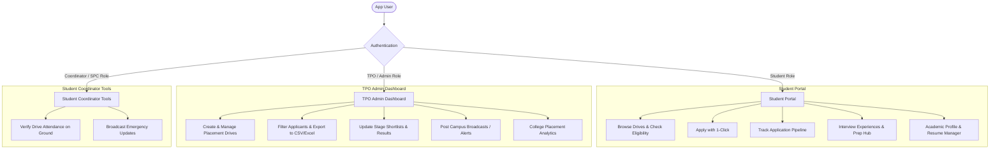
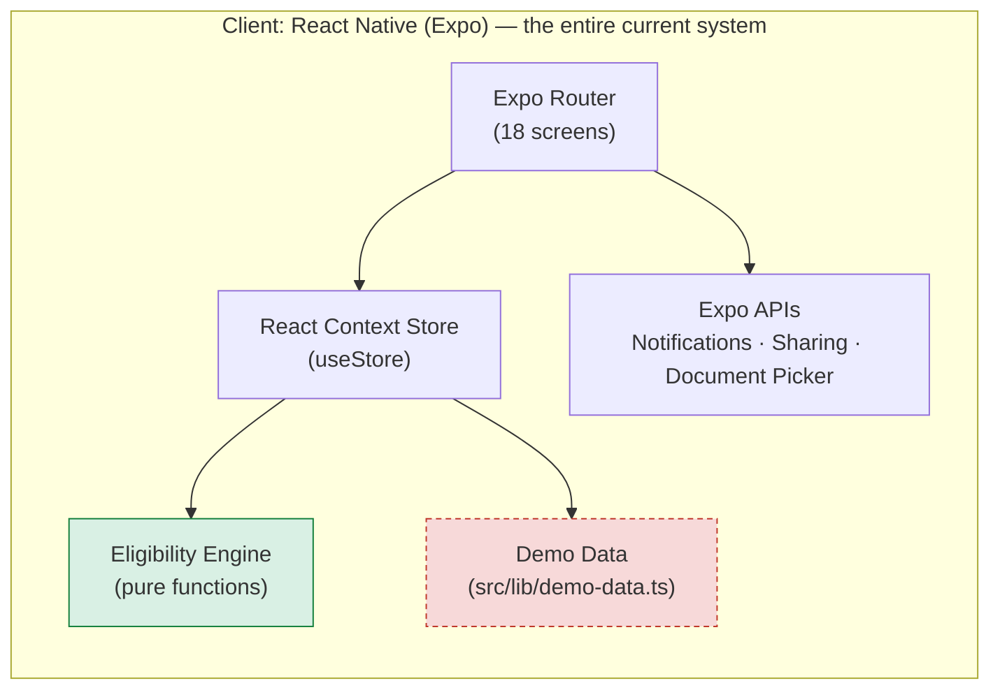
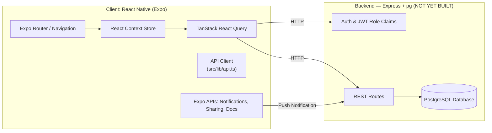
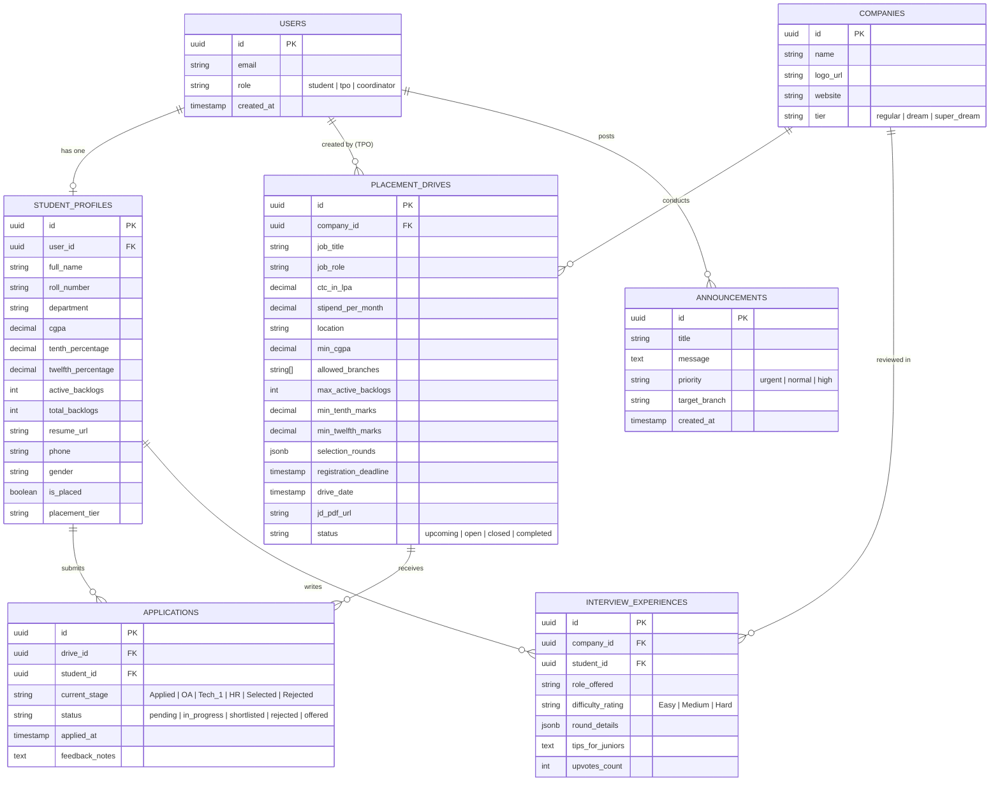

# 🎓 CampusHire — University Placement Cell Mobile Application
> **Comprehensive Architecture, Feature Specification & Development Roadmap**  
> **Platform:** React Native (Expo Managed Workflow)  
> **Target OS:** Android & iOS (Cross-Platform)  
> **Institution:** Dr. Hari Singh Gour Central University, Sagar, Madhya Pradesh

---

## ⚠️ Implementation Status — Read This First

> **The current build has NO database and NO backend. All data is in-memory demo data.**
>
> This document originally described a production architecture (PostgreSQL + Express API).
> That backend **has not been built yet**. What exists today is a complete, fully interactive
> front-end that runs entirely on seeded local data.
>
> | Layer | Planned | Currently Built |
> | :--- | :--- | :--- |
> | UI / Screens | 18 screens | ✅ **18 screens — all built and working** |
> | Eligibility engine | Pure function | ✅ **Built and unit-reasoned** |
> | ATS tracker | Stepper UI | ✅ **Built** |
> | CSV export | File generation + share | ✅ **Built (hand-rolled, no library)** |
> | Database | PostgreSQL | ❌ **Not built — dummy data** |
> | API server | Express + pg | ❌ **Not built** |
> | Authentication | Email/password + JWT | ❌ **Role switcher only (no real login)** |
> | Push notifications | Backend triggers | ⚠️ **Local scheduling only** |
>
> **What this means in practice:** every screen is functional and demonstrable, but data resets
> when the app reloads. Nothing persists. The backend is the next phase — see §10.
>
> The data layer was deliberately structured for this: `src/lib/types.ts` mirrors the database
> schema, and all state mutations are isolated in the store's action functions, so swapping
> demo data for real API calls does not require rewriting any screen.

---

## 1. Executive Summary & Problem Statement

### The Problem
University placement drives are traditionally disorganized:
- Training & Placement Offices (TPOs) communicate via chaotic WhatsApp groups, scattered emails, and Google Sheets.
- Students miss registration deadlines or struggle to know whether they meet complex criteria (CGPA cutoff, backlog limits, branch constraints).
- Tracking interview stages (Online Assessment $\rightarrow$ Technical Round $\rightarrow$ HR $\rightarrow$ Offer) causes stress and lack of transparency.
- Manual eligibility verification takes hundreds of hours of staff time.

### The Solution: CampusHire
A unified, mobile-first Placement Management Ecosystem built with **React Native (Expo)** featuring:
1. **Automated Eligibility Engine**: Instant calculation showing whether a student qualifies to apply based on their live academic record.
2. **Interactive ATS (Application Tracking System)**: Visual step-by-step progress tracking for every applied drive.
3. **Multi-Role Portal**: Dedicated student views and TPO/Coordinator administrative dashboards.
4. **Senior Interview Experiences & Archives**: Peer-to-peer placement preparation hub.
5. **Real-time Notifications & Announcements**: Instant broadcast alerts for drive schedules, venue changes, and shortlists.

---

## 2. User Personas & Role-Based Access Control (RBAC)



---

## 3. Comprehensive Feature Matrix

> **Legend:** ✅ implemented and working · ⚠️ partially implemented · ⬜ not started
> The "Implementation Details" column reflects what was **actually built**, which in several
> cases differs from the original recommendation.

### 3.1. Student Modules

| Feature | Description | Implementation Details |
| :--- | :--- | :--- |
| **Academic Profile Onboarding** | Captures 10th %, 12th/Diploma %, Current CGPA, Branch, Active & Historical Backlogs, Skills, and Resume PDF. | Multi-step form with validation (`react-hook-form` + `zod`). |
| **Smart Eligibility Engine** | Compares student credentials against drive rules in real-time. Displays a badge (**Eligible** ✅ / **Ineligible** ❌) with explicit criteria reasons. | Dynamic evaluation function: evaluates CGPA, Branch, Backlogs, and Gender diversity criteria. |
| **Drive Explorer & Categorization** | Filter drives by Category (**Super Dream** $\ge 12$ LPA, **Dream** 6–12 LPA, **Regular** $< 6$ LPA), Job Type (Internship / Full-time), or Status (Open / Upcoming / Closed). | FlatList with optimized rendering, search bar, chips filter. |
| **Job Detail Sheet & JD Viewer** | Complete job profile: CTC breakdown, roles, stipend, selection stages timeline, registration deadline countdown timer, and embedded JD PDF view. | `expo-document-picker`, `react-native-pdf` or system webview. |
| **Application Pipeline Tracker (ATS)** | Visual vertical/horizontal stepper displaying current status: `Applied` $\rightarrow$ `OA Shortlist` $\rightarrow$ `Tech Round 1` $\rightarrow$ `HR Round` $\rightarrow$ `Offered` / `Rejected`. | Custom stepper component with color-coded status badges and interview slot details. |
| **Peer Interview Experience Hub** | Read reviews and questions from seniors who cracked companies (difficulty ratings, rounds, key DSA/tech topics). | Searchable community feed with upvoting and company tags. |
| **Placement Policy & Offer Rules** | Displays college guidelines (e.g., "1 Core + 1 Dream Offer" rule, penalty/blacklisting rules for no-shows). | Markdown viewer screen with easy reference search. |
| **Push Notifications** | Instant alerts for shortlisted students, OA test links, upcoming interview reminders, and deadline warnings. | `expo-notifications` linked with backend triggers. |

---

### 3.2. TPO & Placement Coordinator (Admin) Modules

| Feature | Description | Implementation Details |
| :--- | :--- | :--- |
| **Drive Creation Wizard** | Publish a job drive with company details, CTC package, registration deadline, eligibility constraints, and round definitions. | Multi-step form with date-time picker (`@react-native-community/datetimepicker`). |
| **Applicant Management & Filtering** | View all registered students per drive. Instant filtering by CGPA range, department, gender, and backlog count. | Virtualized data table with filter chips and search. |
| **1-Click CSV/Excel Export** | Generate official applicant lists formatted for company HRs (Roll No, Name, Email, CGPA, Resume link). | `xlsx` / `json-to-csv` export integrated with `expo-sharing`. |
| **Round Advancement / Bulk Status Update** | Move selected candidates from Round 1 to Round 2 with one tap or by uploading a shortlist file. | Batch status mutation with optimistic UI update. |
| **Campus Broadcast / Notice Board** | Send priority announcements (e.g., "Google OA delayed by 30 mins to Lab 3"). | Push notification broadcast with alert priority tagging (`Urgent`, `Info`, `Results`). |
| **Placement Analytics Dashboard** | Real-time graphs: Total Placed vs Unplaced %, Branch-wise placement rate, Average & Highest CTC package. | `react-native-chart-kit` or `victory-native`. |

---

## 4. The "Killer Feature": Automated Eligibility Calculation Engine

One of the main reasons college projects receive top marks is demonstrable business logic. Here is the formal specification of the Eligibility Engine:

```typescript
export interface EligibilityCriteria {
  minCgpa: number;
  allowedBranches: string[];
  maxActiveBacklogs: number;
  maxBacklogHistory: number;
  minTenthMarks: number;
  minTwelfthMarks: number;
  allowedGenders?: ('all' | 'male' | 'female');
}

export interface StudentProfile {
  cgpa: number;
  branch: string;
  activeBacklogs: number;
  totalBacklogHistory: number;
  tenthPercentage: number;
  twelfthPercentage: number;
  gender: 'male' | 'female' | 'other';
  hasAcceptedOffer: boolean;
  acceptedOfferCtc?: number;
}

export interface EligibilityResult {
  isEligible: boolean;
  reasons: {
    rule: string;
    passed: boolean;
    studentValue: string | number;
    requiredValue: string | number;
  }[];
}

export function evaluateEligibility(
  student: StudentProfile,
  criteria: EligibilityCriteria,
  collegePolicy: { maxOffers: number; dreamTierThreshold: number }
): EligibilityResult {
  const reasons = [
    {
      rule: 'CGPA Cutoff',
      passed: student.cgpa >= criteria.minCgpa,
      studentValue: student.cgpa.toFixed(2),
      requiredValue: `≥ ${criteria.minCgpa}`,
    },
    // …
  ];

  const isEligible = reasons.every((r) => r.passed);
  return { isEligible, reasons };
}
```

> **Note:** the code above is the original sketch. The **implemented** engine differs
> deliberately — see §4.1 for what shipped and why it is stronger.

### 4.1 As Implemented

The shipped engine (`src/lib/eligibility.ts`) returns far more than a boolean:

```typescript
type EligibilityResult = {
  isEligible: boolean;
  score: number;                        // pass ratio, 0–100
  passedCount: number;
  totalRules: number;
  reasons: EligibilityRuleResult[];     // EVERY rule, passing and failing
  failures: string[];                   // named failures, for the Apply tooltip
  warnings: string[];                   // policy issues that should not hard-block
};
```

Four design decisions that make this defensible in an evaluation:

1. **It returns every rule, not just the failures.** A student who is ineligible can see
   *exactly* which single requirement they missed and by how much. A bare `false` would
   force them to email the placement cell.

2. **Failures and warnings are separated.** A backlog warning from college policy is
   informational; failing the CGPA cutoff is disqualifying. Collapsing these into one
   boolean would block students who are legitimately allowed to apply.

3. **It is pure.** No React, no I/O, no side effects. This makes it directly unit-testable
   in isolation and reusable from both portals — the student UI uses it to gate the Apply
   button, and the TPO dashboard uses the same function to report applicant quality. One
   source of truth for the business rule.

4. **It is the single enforcement point.** Ineligibility is enforced inside the store's
   `applyToDrive` action, not merely disabled in the UI. A disabled button is a UI
   convention; a server-side check is a guarantee. When the backend lands, this same
   function should be invoked there too.

**Demonstration path:** sign in as the demo student (Sarthak Upadhyay, CGPA 8.5) and open
the **Goldman Sachs** drive — a female-only diversity hire. The scorecard shows
`✕ Gender Criteria`, the Apply button is disabled, and the reason is named on screen.

---

## 5. System Architecture & Tech Stack

### 5.1 Current Architecture — As Built

> The client talks to **nothing**. There is no server and no database in this build.



The dashed red box is the part that gets replaced in Phase 7.

### 5.2 Target Architecture — After Phase 7



### 5.3 Technology Selections — As Built vs Planned

| Layer | Actually Used | Rationale / Change |
| :--- | :--- | :--- |
| **Framework** | React Native (Expo SDK 57) | Original plan said SDK 51+. SDK 57 ships React 19.2 and React Compiler. |
| **Routing** | Expo Router (file-based) | Unchanged. JS `Tabs` navigator, **not** `NativeTabs` — see §10.4. |
| **Styling** | `StyleSheet` + theme tokens | **Changed from NativeWind.** Less build complexity at this scale. |
| **Typography** | Playfair Display + Inter | Editorial serif/sans pairing, loaded via `expo-font`. |
| **State** | React Context | **Changed from Zustand.** No server cache exists yet to justify it. |
| **Forms** | React Hook Form + Zod | Unchanged, as planned. |
| **Data** | In-memory demo data | **Backend not built.** See §10. |
| **CSV export** | Hand-rolled + `expo-sharing` | **Changed from `xlsx`** — high-severity advisory, unpublished package. |
| **Visual effects** | `expo-blur`, `expo-linear-gradient` | Added for the glassmorphism design system. |

---

## 6. Database Schema Design (PostgreSQL) — Designed, Not Yet Implemented

> **This section is a design specification, not a description of working code.**
> No database exists in the current build. The schema below is what Phase 7 will implement,
> and `src/lib/types.ts` already mirrors it in TypeScript so the mapping is close to mechanical.

### 6.1. Entity Relationship (ER) Diagram



---

## 7. Complete Mobile Screen Sitemap & Navigation Flow

```
app/
├── (auth)/
│   ├── login.tsx                   # Email/Password + Role Selector
│   ├── register.tsx                # Student registration with College Email
│   └── student-onboarding.tsx      # Multi-step profile setup (CGPA, marks, resume)
│
├── (student)/
│   ├── _layout.tsx                 # Bottom Tabs Navigator
│   ├── (tabs)/
│   │   ├── index.tsx               # Dashboard (Upcoming drives, urgent notices, metrics)
│   │   ├── drives/
│   │   │   ├── index.tsx           # Drives Feed (Filter by eligibility, CTC tier, date)
│   │   │   └── [id].tsx            # Drive Details (Eligibility scorecard, JD, "Apply" CTA)
│   │   ├── applications/
│   │   │   ├── index.tsx           # My Applications (Active vs History)
│   │   │   └── [id].tsx            # Visual Pipeline Stepper (Round-by-round status)
│   │   ├── prep/
│   │   │   ├── index.tsx           # Senior Interview Experiences & Company archives
│   │   │   └── [id].tsx            # Full interview experience breakdown
│   │   └── profile/
│   │       ├── index.tsx           # Academic scorecard & Resume viewer
│   │       └── edit.tsx            # Update profile info / upload new resume
│
├── (tpo)/
│   ├── _layout.tsx                 # Admin Bottom Tabs Navigator
│   ├── dashboard.tsx               # Live College Placement Stats (Placed %, Avg CTC)
│   ├── drives/
│   │   ├── index.tsx               # Manage Drives list + FAB "Create Drive"
│   │   ├── create.tsx              # Drive Creation Wizard Form
│   │   └── [id]/
│   │       ├── applicants.tsx      # Applicant Filter Table + "Export CSV"
│   │       └── advance-round.tsx   # Bulk shortlist students to next round
│   ├── broadcasts/
│   │   ├── index.tsx               # Notice board manager
│   │   └── create.tsx              # Compose push notification announcement
│   └── students/
│       └── index.tsx               # Master Student Directory (Search by CGPA, branch)
│
└── _layout.tsx                     # Root layout, theme provider, and auth gatekeeper
```

---

## 8. Implementation Roadmap — Actual Status

> Sprint 1–5 were re-scoped during implementation to match the decisions actually taken.
> The deviations are noted honestly rather than retro-fitted.

### ✅ Phase 1 — Project Scaffolding & Design System (Complete)
- Initialised Expo SDK 57 project with Expo Router (file-based navigation).
- **Deviation from original plan:** chose plain `StyleSheet` + theme tokens over
  **NativeWind/Tailwind**. Tailwind adds a Babel/Metro configuration layer for modest gain
  at this scale; the token system gives the same consistency with less indirection.
- **Deviation:** chose a **monochrome editorial** palette over the original indigo/vibrant
  scheme. Greyscale throughout, with colour reserved strictly for semantic meaning
  (green = eligible, red = ineligible, amber = deadline).
  - Light mode: `#FFFFFF` surface, `#0A0A0A` ink
  - Dark mode: `#000000` surface, `#FAFAFA` ink
- Typography: **Playfair Display** (display serif) + **Inter** (UI sans), loaded via
  `expo-font`. Negative letter-spacing on display sizes; wide-tracked uppercase micro-labels.
- Surfaces: **glassmorphism** (`expo-blur`) on the tab bar and hero panels, plus a restrained
  four-step **elevation scale** for depth hierarchy.
- UI kit built: `Txt`, `Display`, `Eyebrow`, `Card`, `Glass`, `Badge`, `Button`, `Input`,
  `Chip`, `Logo`, `ProgressBar`, `EmptyState`, `Section`, `RowLink`, `Toast`, `Screen`.

### ✅ Phase 2 — Role-Based Access & Profile (Complete, simplified)
- Multi-role entry screen (Student / Placement Officer / Coordinator) — each opens a
  **completely separate portal** via route-level redirects.
- **Deviation:** there is **no real authentication**. No password, no JWT, no session.
  Role selection is a local state toggle. Real auth is deferred to the backend phase.
- Academic profile screen with live scorecard and resume upload via `expo-document-picker`.
- State: **React Context**, not Zustand — chosen because there is no server cache to
  synchronise yet. Revisit when the API lands.

### ✅ Phase 3 — Drive Feed & Automated Eligibility Engine (Complete)
- Drive feed with search, tier chips (Super Dream / Dream / Regular / Internship) and
  status filters. Every card pre-computes and displays an eligibility verdict.
- Drive detail screen with deadline countdown, CTC breakdown, and the **eligibility scorecard**.
- **Eligibility engine** (`src/lib/eligibility.ts`) — pure, deterministic, side-effect free:
  - Returns *every* rule (passing and failing), not a bare boolean.
  - Computes a pass ratio score and a named failure list.
  - Separate `warnings[]` for policy issues that shouldn't hard-block (e.g. offer-count limits).
  - Gates the Apply button and names the exact failed rule.
  - Because it is pure, it is directly unit-testable and reusable by both portals.

### ✅ Phase 4 — ATS Tracker & Prep Hub (Complete)
- **Pipeline stepper**: `Applied → OA → Tech 1 → Tech 2 → HR → Offer`, with completed /
  current / pending / rejected states, plus per-stage venue, reporting time, test link.
- Applications list split into Active and History.
- Prep hub: searchable, difficulty-filtered senior interview experiences with round-by-round
  breakdowns and upvoting.

### ✅ Phase 5 — TPO Admin & CSV Export (Complete)
- Analytics dashboard: placement %, branch-wise rates, CTC distribution (pure `View` bars).
- 4-step drive creation wizard using **react-hook-form + zod**, with per-step validation,
  multi-select branch tags and dynamic round builder.
- Applicant table with CGPA / branch / stage / backlog filtering and multi-select.
- **CSV export** — hand-rolled generator in `src/lib/csv.ts` with correct quote escaping,
  written to cache and handed to `expo-sharing` for the native share sheet.
  - **Deviation:** dropped the planned `xlsx` dependency. It carries a high-severity advisory
    and has been unpublished from npm. A comma-separated file needs ~40 lines of code, not a
    dependency with a vulnerability report attached.

### ⚠️ Phase 6 — Polish & Data (Partially Complete)
- Rich demo data: 10 realistic drives (Google, Microsoft, Amazon, Adobe, Goldman Sachs,
  Deloitte, TCS, Infosys, Zoho, Accenture) and a generated 60-student directory.
- Dark mode verified across both palettes.
- **Not done:** automated tests, `react-native-reanimated` micro-animations.

### 📋 Phase 7 — Backend (Not Started)
See §10 for the detailed plan.

---

## 9. Evaluator "Wow Factors" (Why This Project Scores Top Marks)

1. **Practical Real-World Utility**: Solves a direct campus pain point that university evaluators face every semester.
2. **Deterministic Business Logic**: Not just a simple CRUD app; includes automated mathematical eligibility validation based on multi-variable criteria.
3. **Data Export Capability**: Evaluators love seeing the app generate an actual CSV file ready to send to corporate HR recruiters.
4. **Professional Visual Polish**: Visual ATS application stepper, clear status badges, glassmorphism surfaces, and a coherent monochrome editorial design system.
5. **Role-Based Flexibility**: One codebase serving both the student seeker and the university administration.

---

## 10. Phase 7 — Backend Roadmap (Not Yet Built)

This is the next phase. It is specified here so the architecture is already agreed.

### 10.1 Why a separate API server
React Native cannot talk to PostgreSQL directly — there is no Postgres wire protocol in the
client. A thin HTTP API is therefore required. It will live in a sibling `server/` folder
using **Express + `pg`**, keeping the chosen stack intact (no Supabase or other managed
service).

### 10.2 Planned structure
```
server/
├── src/
│   ├── index.ts            # Express app
│   ├── db.ts               # pg Pool
│   ├── routes/
│   │   ├── auth.ts         # register, login, JWT issue
│   │   ├── students.ts
│   │   ├── drives.ts
│   │   ├── applications.ts
│   │   ├── announcements.ts
│   │   └── experiences.ts
│   └── middleware/
│       └── auth.ts         # verify JWT, attach role
├── migrations/
│   ├── 001_schema.sql      # tables per §6 ER diagram
│   └── 002_seed.sql        # demo rows
└── .env.example
```

### 10.3 Migration checklist
1. `docker-compose.yml` for PostgreSQL, plus `schema.sql` implementing §6 and `seed.sql`.
2. Express server with a `pg` pool and CORS.
3. Real authentication: `bcrypt` password hashing + JWT claims carrying the role.
   Replace the role switcher in `src/app/index.tsx` with a login form.
4. Implement each route; return data in the exact shapes already defined in
   `src/lib/types.ts`.
5. Add a thin API client (`src/lib/api.ts`); repoint the store's actions at it.
6. Delete `src/lib/demo-data.ts` once real data is live.

### 10.4 Known risks
- **`NativeTabs` silently drops `router.push` to nested routes.** Detail screens
  (`/drives/[id]`, `/applications/tracker`) are registered in the JS `Tabs` navigator with
  `href: null`. Reverting to `NativeTabs` would break navigation with no error surfaced.
- **Generated route types go stale.** After adding or renaming a route,
  `.expo/types/router.d.ts` must be regenerated (`npx expo export --platform web`) or the
  type checker reports phantom route errors.
- **No hardcoded colours.** All colours must come from `useTheme()`. Seven hardcoded hex
  values silently broke dark mode before this rule was established.

---

## 11. Known Limitations (Honest Accounting)

| Limitation | Impact | Fix |
| :--- | :--- | :--- |
| **No database** | All data resets on reload | Phase 7 |
| **No backend** | Nothing persists or syncs | Phase 7 |
| **No real auth** | Role switcher, not a login | Phase 7 |
| **No automated tests** | Regressions caught manually | Add Vitest for the eligibility engine first |
| **No animations** | Static transitions | `react-native-reanimated` |
| **Notifications need a dev build** | Silent no-op in Expo Go | Documented; calls are guarded |
| **Bulk round advancement is stubbed** | Selection UI exists, mutation does not | Needs the backend |

The most valuable next test to write is for `evaluateEligibility` — it is pure, so it is
cheap to test and it is the piece that carries the project's credibility.

---

## 12. Repository Structure (As Built)

```
mobile-app/
├── src/
│   ├── app/                        # Expo Router — the folder structure IS the navigation
│   │   ├── _layout.tsx             # Root: fonts, splash, StoreProvider
│   │   ├── index.tsx               # Login + role picker
│   │   ├── (student)/
│   │   │   ├── _layout.tsx         # 5 tabs + 3 hidden nested routes
│   │   │   ├── home.tsx            # Dashboard
│   │   │   ├── drives/
│   │   │   │   ├── index.tsx       #   Feed with filters
│   │   │   │   └── [id].tsx        #   Detail + eligibility scorecard
│   │   │   ├── applications/
│   │   │   │   ├── index.tsx       #   Active / History
│   │   │   │   └── tracker.tsx     #   ATS pipeline stepper
│   │   │   ├── prep/
│   │   │   │   ├── index.tsx       #   Interview experiences
│   │   │   │   └── [id].tsx        #   Round breakdown
│   │   │   └── profile/index.tsx   # Academic scorecard + resume
│   │   └── (admin)/
│   │       ├── _layout.tsx         # 4 tabs + 2 hidden nested routes
│   │       ├── dashboard.tsx       # Placement analytics
│   │       ├── drives/
│   │       │   ├── index.tsx       #   Manage drives
│   │       │   ├── create.tsx      #   4-step creation wizard
│   │       │   └── applicants.tsx  #   Filter table + CSV export
│   │       ├── broadcasts.tsx      # Notice board
│   │       └── students.tsx        # Student directory
│   ├── components/
│   │   ├── ui-kit.tsx              # Design system
│   │   ├── eligibility-scorecard.tsx
│   │   └── pipeline-stepper.tsx
│   ├── constants/theme.ts          # Colour, type, elevation, glass tokens
│   ├── hooks/                      # use-theme, use-color-scheme
│   └── lib/
│       ├── eligibility.ts          # ★ The eligibility engine (pure)
│       ├── demo-data.ts            # ★ Seed data — replaced in Phase 7
│       ├── store.tsx               # ★ All state mutations live here
│       ├── types.ts                # Domain types (mirror the DB schema)
│       ├── csv.ts                  # CSV generation + share
│       └── notifications.ts        # Guarded local notifications
├── package.json
├── app.json
└── PLACEMENT_CELL_APP_PLAN.md
```

★ = the three files that define the swap boundary. Replacing demo data with a real API
means rewriting `demo-data.ts` and the bodies of `store.tsx`'s actions — **no screen changes.**

### 12.1 How to Run

```bash
npm install
npx expo start      # scan QR with Expo Go, or press w for the browser
npx tsc --noEmit    # verify type safety
```

### 12.2 Demo Accounts

| Role | User | Portal |
| :--- | :--- | :--- |
| Student | Sarthak Upadhyay — CSE, CGPA 8.5 | Drives, eligibility, ATS, prep hub |
| Placement Officer | Dr. Anjali Verma | Analytics, drives, applicants, CSV export |
| Student Coordinator | Rohit Sharma | Broadcasts, campus notices |

### 12.3 Suggested Demo Script (for evaluation)

1. **Login** — switch between Student and Placement Officer to show role separation.
2. **Drives feed** — point out that every card already carries a computed eligibility verdict.
3. **Goldman Sachs drive** — the centrepiece. Show the scorecard failing on *Gender Criteria*,
   the disabled Apply button, and the named reason. This demonstrates deterministic business
   logic, not a CRUD form.
4. **Apply to an eligible drive** — one tap, appears instantly in the ATS tracker.
5. **Application tracker** — walk the stepper through stages, venues and reporting times.
6. **Switch to Placement Officer** — analytics dashboard, then drive creation wizard.
7. **Applicants table** — filter by CGPA and stage, then **Export CSV** and show the native
   share sheet. Ending on a real, exportable artefact is the strongest close.

---
